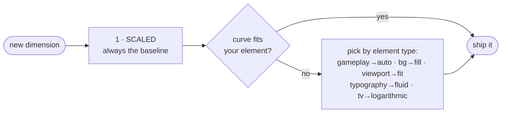

# 📚 AppDimens Games — Documentation Index

> **Artifact:** `io.github.bodenberg:appdimens-games:3.0.1` (+13 satellites, BOM, native)

## Quick links

0. **[Guide for Beginners — full tutorials per stack](GUIDE-FOR-BEGINNERS.md)** 📘 Kotlin · Compose · C++/NDK · OpenGL ES · Vulkan · DirectX · Unity/Godot/MAUI — *start here*
1. [Mathematics & Calculus](MATHEMATICS-AND-CALCULUS.md)
2. [Modules & Artifacts](MODULES.md)
3. [Native Game Engines — C/C++/NDK · OpenGL ES · Vulkan · DirectX · JNI (exemplos completos)](NATIVE-GAME-ENGINES.md)
4. [C# / Unity / Godot / MAUI — bootstrap, uGUI, câmera letterbox, DOTS/Burst](CSHARP-UNITY.md)
5. [Performance / BenchLab](../PERFORMANCE.md)

## Strategy docs

Each doc follows the family skeleton: *What it is · Calculation · How to use · Why · When · Trade-offs · Recommendation*.

| # | Strategy | Doc | Artifact |
|---|---|---|---|
| 1 | Scaled (`sdp/hdp/wdp`) | [scaled.md](strategies/scaled.md) | `appdimens-games` |
| 2 | Percent + space* | [percent.md](strategies/percent.md) | `…-percent` |
| 3 | Power (Stevens) | [power.md](strategies/power.md) | `…-power` |
| 4 | Fluid (clamp band) | [fluid.md](strategies/fluid.md) | `…-fluid` |
| 5 | Auto (balanced hybrid) | [auto.md](strategies/auto.md) | `…-auto` |
| 6 | Diagonal | [diagonal.md](strategies/diagonal.md) | `…-diagonal` |
| 7 | Fill (cover) | [fill.md](strategies/fill.md) | `…-fill` |
| 8 | Fit (letterbox) | [fit.md](strategies/fit.md) | `…-fit` |
| 9 | Interpolated | [interpolated.md](strategies/interpolated.md) | `…-interpolated` |
| 10 | Logarithmic | [logarithmic.md](strategies/logarithmic.md) | `…-logarithmic` |
| 11 | Perimeter | [perimeter.md](strategies/perimeter.md) | `…-perimeter` |
| 12 | Density | [density.md](strategies/density.md) | `…-density` |
| 13 | Resize (container fit) | [resize.md](strategies/resize.md) | `…-resize` |

## Decision flow

## Suffix semantics (all strategies)

| Suffix | Flag | Behavior on window resize |
|---|---|---|
| — | live metrics | adjusts automatically |
| `a` | aspect-ratio refinement | adjusts automatically |
| `i` | invariant | **frozen** at last fullscreen reference |
| `ia` | both | frozen + AR |

[Back to root README](../README.md)
