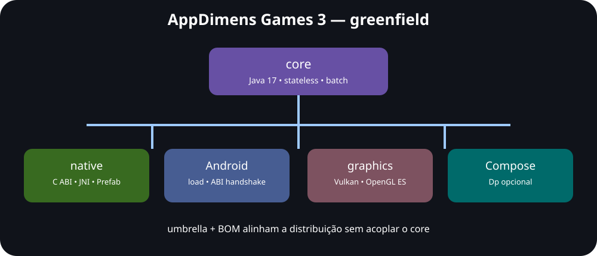

# AppDimens Games 3.1.6

Biblioteca **greenfield** de dimensionamento responsivo para jogos Android. A versão 3
substitui integralmente a implementação antiga por um motor determinístico em Java 17 e
C++17, ABI C estável, JNI em lote e módulos opcionais para Compose e APIs gráficas.



## Por que uma edição para games?

UI convencional pode recalcular durante layout. Um jogo não pode desperdiçar o budget de
8,33 ms (120 Hz) atravessando JNI por sprite. AppDimens Games calcula na criação/alteração
do viewport, processa arrays em lote, não acessa drivers e permite reutilizar os resultados
em Vulkan, OpenGL ES, Canvas, GameActivity ou engines próprias.

## Módulos

| Artefato | Conteúdo | Android obrigatório? |
|---|---|---|
| `appdimens-games-core` | fórmulas, batch, safe area, viewport e inferência | não |
| `appdimens-games-native` | C ABI, C++17, JNI e Prefab | sim |
| `appdimens-games-android` | facade JNI segura | sim |
| `appdimens-games-graphics` | adapters Vulkan/OpenGL renderer-neutral | não |
| `appdimens-games-compose` | API `Dp` opcional | sim |
| `appdimens-games` | umbrella com todos os módulos | sim |
| `appdimens-games-bom` | alinhamento de versões | não |

```kotlin
dependencies {
    implementation(platform("io.github.bodenberg:appdimens-games-bom:3.1.6"))
    implementation("io.github.bodenberg:appdimens-games-core")
    // ou implementation("io.github.bodenberg:appdimens-games")
}
```

## Uso JVM/Kotlin

```kotlin
val screen = Screen(360f, 800f, 3f, Insets(0f, 24f, 0f, 16f))
val player = Calculator.scale(64f, Strategy.BALANCED, screen)
val strategy = StrategySelector.forElement(ElementType.PLAYER)

// Uma única passagem, sem objetos por elemento; suporta input === output.
Calculator.scale(values, 0, values, 0, values.size, strategy, screen, ScaleConfig.DEFAULT)
```

No Android, `AndroidScreens.capture(activity)` cria o snapshot usando `WindowMetrics`,
system bars e display cutout em API 30+, com fallback compatível para API 23–29.

## Uso NDK/Prefab

```cmake
find_package(appdimens_games REQUIRED CONFIG)
target_link_libraries(my_game PRIVATE appdimens_games::appdimens_games)
```

```cpp
#include <appdimens_games.h>
adg_screen screen{360, 800, 3, {0, 24, 0, 16}};
adg_config config = adg_default_config();
adg_scale_batch(values, 0, values, 0, count, ADG_BALANCED, &screen, &config);
```

O ABI retorna `adg_status`, rejeita entradas inválidas, aceita strides e suporta buffers
sobrepostos com semântica equivalente a `memmove`. `adg_abi_version()` detecta binários
incompatíveis antes do primeiro frame.

## Estratégias

`NONE`, `DEFAULT`, `PERCENTAGE`, `BALANCED`, `LOGARITHMIC`, `POWER`, `FLUID`,
`INTERPOLATED`, `DIAGONAL`, `PERIMETER`, `FIT`, `FILL` e `AUTOSIZE` usam IDs estáveis
em Java e C. Veja fórmulas, limites e recomendações em [API e estratégias](docs/API.md).

## Integração gráfica

`GraphicsViewport.openGl(...)` e `GraphicsViewport.vulkan(...)` produzem valores em pixels
sem chamar `glViewport`, criar `VkViewport` ou guardar handles. Assim, a biblioteca funciona
em qualquer thread e a engine mantém total controle de sincronização, Y-flip e render pass.
Veja [Vulkan, OpenGL e engines](docs/guides/GRAPHICS.md).

## Performance

* calcule apenas em resize, rotação, fold/unfold, mudança de DPI ou safe area;
* use batch JVM ou JNI, nunca uma transição JNI por entidade;
* mantenha `Screen` e `ScaleConfig` imutáveis junto ao snapshot do viewport;
* converta dp para pixels uma vez antes de preencher UBOs, push constants ou vertices;
* meça no hardware alvo — throttling, ART e drivers alteram resultados.

Detalhes: [arquitetura](docs/ARCHITECTURE.md), [performance](docs/PERFORMANCE.md),
[migração](docs/MIGRATION.md), [dependências auditadas](docs/DEPENDENCIES.md) e
[validação](docs/VALIDATION.md).

## Build e validação

```bash
tools/validate.sh
./gradlew check assembleRelease
```

O primeiro comando não depende do Android SDK: compila o core com `javac -Xlint:all
-Werror` e o ABI nativo com `-Wall -Wextra -Werror -pedantic`, depois executa CTest.

## Compatibilidade

Android 6/API 23+, Java 17, C++17, CMake 4.1.2 e ABIs `arm64-v8a`, `armeabi-v7a`,
`x86` e `x86_64`. Consulte [SECURITY.md](SECURITY.md) para reportar vulnerabilidades.

Apache License 2.0 — veja [LICENSE](LICENSE).

## API paralela ao AppDimens Dynamic

A versão 3.1.6 agora oferece módulos e nomenclaturas equivalentes ao Dynamic, reimplementados para o contexto de games. Exemplo:

```kotlin
import com.appdimens.games.compose.fit.ftsdp
import com.appdimens.games.compose.fit.ftssp

val hitTarget = 48.ftsdp
val hudLabel = 16.ftssp
```

Consulte a [matriz completa de paridade](docs/DYNAMIC_PARITY.md) para módulos, propriedades e funções explícitas.
