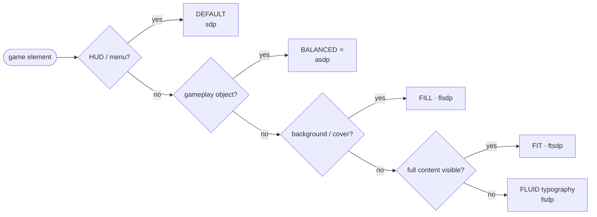

<div align="center">

# 🎮 AppDimens Games

### Unified, high-performance dimension scaling for Android games — Compose · Kotlin · Java · C++/NDK · C · OpenGL ES · Vulkan · DirectX · Unity/C#

[](https://central.sonatype.com/)
[](LICENSE)
[](#)
[](#)
[](#)
[](DOCUMENTATION/README.md)

[](DOCUMENTATION/GUIDE-FOR-BEGINNERS.md)
[](DOCUMENTATION/README.md)
[](DOCUMENTATION/MATHEMATICS-AND-CALCULUS.md)
[](DOCUMENTATION/NATIVE-GAME-ENGINES.md)
[](PERFORMANCE.md)

</div>

**AppDimens Games 3.0** is the complete conversion of the AppDimens family (`appdimens-kmp` 1.x, `appdimens-dynamic` 3.x) to **game development**, replacing the deprecated `appdimens-games` 2.0.1. Same canonical math, same API vocabulary, engineered for **60+ FPS game loops**: every hot path is a single multiply over pre-computed factors published by an immutable window snapshot.

> 💡 **One rule:** when the screen/window resizes, **every value auto-adjusts** — except variants with the **`i`** suffix, which stay anchored to the frozen fullscreen reference.

---

## 📦 Installation

```kotlin
// settings.gradle.kts → repositories { mavenCentral(); ... }

// All-in-one core (recommended for most games)
implementation("io.github.bodenberg:appdimens-games:3.0.0")

// Or modular — pick only your strategies:
implementation("io.github.bodenberg:appdimens-games:3.0.0")   // core (required)
implementation("io.github.bodenberg:appdimens-games-fluid:3.0.0")
implementation("io.github.bodenberg:appdimens-games-fit:3.0.0")
// auto · density · diagonal · fill · interpolated · logarithmic ·
// percent · perimeter · power · resize · units

// Native engines (C/C++/JNI + GL/Vulkan/DirectX interop)
implementation("io.github.bodenberg:appdimens-games-native:3.0.0")

// Or via BOM
implementation(platform("io.github.bodenberg:appdimens-games-bom:3.0.0"))
```

| Requirement | Version |
|---|---|
| minSdk | **24** |
| compileSdk | 35 |
| Kotlin / JDK | 2.x / 17 |

---

## ⚡ Quick start

### Kotlin / Java games (any engine)

```kotlin
// Wire-up once per resize/config change (Activity, SurfaceView or Vulkan swapchain):
override fun onSurfaceChanged(...) {
    GameScreen.updateFromContext(context)
}

// Game loop (allocation-free):
val player = AppDimensGamesJava.playerSize(64f)   // BALANCED (recommended default)
val hud    = AppDimensGamesJava.hud(48f)          // DEFAULT (~97% linear + AR)
val world  = AppDimensGamesJava.worldSize(200f)   // PERCENTAGE
val bg     = AppDimensGamesJava.background(100f)  // FILL (cover)
```

```java
float touch = AppDimensGamesJava.touchTarget(48f);   // DIAGONAL — physical consistency
```

### Kotlin fluent DSL (migration from 2.0.1)

```kotlin
val player = 64f.smart().forElement(GameElementType.PLAYER).dp
val text   = 16f.smart().withStrategy(GameScalingStrategy.FLUID).withFluid(12f, 24f).dp
```

### Compose games

```kotlin
AppDimensGamesProvider {
    Box(Modifier.size(48.bdp)) {          // BALANCED — auto-adjusts on resize
        Text("SCORE", fontSize = 16.sdp.sp)   // scaled — follows the window
    }
}
```

### Prefix shortcuts (family parity)

| Strategy | Dp stems | Example |
|---|---|---|
| scaled | `sdp / hdp / wdp` | `16.sdp(ctx)` |
| percent | `psdp / phdp / pwdp` + `spaceW/spaceH` | `10.spaceW(ctx)` |
| power | `pwsdp…` | `16f.pwsdp(ctx)` |
| fluid | `fsdp / fhdp / fwdp` | `16f.fsdp(ctx)` |
| auto | `asdp…` | `16f.asdp(ctx)` |
| diagonal | `dgsdp…` | `48f.dgsdp(ctx)` |
| fill | `flsdp…` | `100f.flsdp(ctx)` |
| fit | `ftsdp…` | `100f.ftsdp(ctx)` |
| interpolated | `isdp…` | `16f.isdp(ctx)` |
| logarithmic | `logsdp…` | `50f.logsdp(ctx)` |
| perimeter | `prsdp…` | `16f.prsdp(ctx)` |
| density | `dsdp…` | `16f.dsdp(ctx)` |

### Suffix system (identical to Dynamic/KMP)

| Suffix | Meaning | Resize behavior |
|---|---|---|
| *(none)* | standard scaling | ✅ auto-adjusts on window resize |
| **`a`** | applies aspect-ratio refinement (`1+K·ln((max/min)/1.78)`) | ✅ auto-adjusts |
| **`i`** | **invariant**: ignores resized-window/multi-window adjustments | 🔒 anchored to the frozen fullscreen reference |
| **`ia`** | both | 🔒 |

```kotlin
16.sdp(ctx)   // adjusts on split-screen / freeform resize
16.sdpi(ctx)  // stays as designed for fullscreen — HUD stability
```

### C / C++ / NDK (OpenGL · Vulkan · DirectX)

```cpp
#include "appdimens/games/core.h"
#include "appdimens/games/math.h"
#include "appdimens/games/render.h"

using namespace appdimens::games;

void onSurfaceChanged(float wDp, float hDp, float dpi) {
    static const Metrics m = Metrics::make(wDp, hDp, 0.f, dpi);
    updateMetrics(m);                      // publishes lock-free snapshot
}

void frame() {
    const Metrics& m = metrics();
    float playerPx = math::toPx(math::autoDp(64.f, m), m);   // 1 multiply fast lane
    float hudPx    = math::toPx(baseOrInvariant(48.f), m);   // `i`: invariantMetrics()
}

// Vulkan/DirectX-ready viewport (letterbox), layout-compatible with VkViewport / D3D11_VIEWPORT:
auto vp = render::vkViewport(render::Mode::FitAll, surfaceW, surfaceH, 1920.f, 1080.f);
```

Pure C99 engines (raylib, SDL, custom): single header [`c/appdimens_games_c.h`](library-native/src/main/cpp/c/appdimens_games_c.h).

Full guides: [NATIVE-GAME-ENGINES.md](DOCUMENTATION/NATIVE-GAME-ENGINES.md) · [CSHARP-UNITY.md](DOCUMENTATION/CSHARP-UNITY.md)

---

## 🧠 How it works (auto-resize architecture)


* **Zero allocation** on hot paths; zero locks on reads.
* Cache partitions are keyed by snapshot identity — a resize isolates stale entries automatically.
* Custom sensitivities are never cached (aliasing guard — family parity).

---

## 🗺️ Which strategy for my game?



---

## 📊 Performance contract

| Path | Cost |
|---|---|
| Fast lane dp→px | **~2 ns** (`base × factor`) |
| Kernel full (cold) | 15–40 ns, allocation-free |
| Snapshot rebuild | once per resize |
| `ln()` | exact, computed at snapshot creation only |

Run the on-device comparison yourself: [`benchlab/`](benchlab) (games-3.0 vs games-2.0.1 vs dynamic-3.1.9). Methodology and historical numbers: [PERFORMANCE.md](PERFORMANCE.md).

---

## ✨ What's new in 3.0.0

| Change | Detail |
|---|---|
| 🔁 **Family unification** | Bit-exact parity with `appdimens-dynamic` 3.1.9 kernels & constants; oracle-tested (`scripts/oracle.py`, 30 cases). |
| 🚀 **Snapshot engine** | Replaces legacy hash-per-call gateway with precomputed factors + lock-free cache. |
| 🔒 **`i` semantics for games** | Invariant values anchor to the last fullscreen snapshot under split-screen/freeform. |
| ⚙️ **True native layer** | Header-only C++20 core + pure C99 header + JNI bridge; GL/Vulkan/DirectX viewport interop. |
| 🧩 **Modularized** | Core + 13 satellite artifacts + BOM (same shape as dynamic/kmp). |
| 🧱 **Game world layer** | Vec2/Vec3, Rect, ViewportMode letterbox/crop, world↔screen mapping, safe-area ready. |
| 🧪 **BenchLab + sample** | On-device benchmark vs legacy/dynamic; sample game with Compose, OpenGL ES and Vulkan surfaces. |

---

## 📚 Documentation

| Doc | Content |
|---|---|
| [DOCUMENTATION/README.md](DOCUMENTATION/README.md) | Index + decision flowchart |
| [DOCUMENTATION/GUIDE-FOR-BEGINNERS.md](DOCUMENTATION/GUIDE-FOR-BEGINNERS.md) | Step-by-step for game devs |
| [DOCUMENTATION/MATHEMATICS-AND-CALCULUS.md](DOCUMENTATION/MATHEMATICS-AND-CALCULUS.md) | Formal reference (LaTeX) |
| [DOCUMENTATION/MODULES.md](DOCUMENTATION/MODULES.md) | Artifacts matrix |
| [DOCUMENTATION/NATIVE-GAME-ENGINES.md](DOCUMENTATION/NATIVE-GAME-ENGINES.md) | JNI · C · C++ · GL · Vulkan · DirectX |
| [DOCUMENTATION/CSHARP-UNITY.md](DOCUMENTATION/CSHARP-UNITY.md) | Unity/Godot port |
| [PERFORMANCE.md](PERFORMANCE.md) | BenchLab methodology & results |

---

## 🤝 Family

| Repo | Stack |
|---|---|
| [appdimens](https://github.com/bodenberg/appdimens) | Hub (Android/iOS/web/Flutter/RN) |
| [appdimens-dynamic](https://github.com/bodenberg/appdimens-dynamic) | Android (Compose/XML/Kotlin/Java) |
| [appdimens-kmp](https://github.com/bodenberg/appdimens-kmp) | Kotlin Multiplatform |

---

<div align="center">

**Apache License 2.0** · © Jean Bodenberg · Games 3.0 unified conversion

</div>
