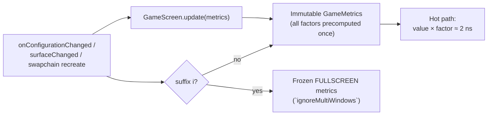

<div align="center">

# 🎮 AppDimens Games


### Unified, high-performance dimension scaling for Android games — Compose · Kotlin · Java · C++/NDK · C · OpenGL ES · Vulkan · DirectX · Unity/C#

[](#)
[](LICENSE)
[](#)
[](#)
[](#)
[](#)
[](#)
[](DOCUMENTATION/README.md)

[](DOCUMENTATION/GUIDE-FOR-BEGINNERS.md)
[](DOCUMENTATION/README.md)
[](DOCUMENTATION/MATHEMATICS-AND-CALCULUS.md)
[](DOCUMENTATION/NATIVE-GAME-ENGINES.md)
[](PERFORMANCE.md)

</div>

**AppDimens Games 3.0** is the family conversion of AppDimens (`appdimens-dynamic` 3.x, `appdimens-kmp` 1.x) to **game development**, replacing the deprecated games 2.0.1. **Same API vocabulary, same suffixes, same facilitators** as the rest of the family — engineered for **60+ FPS game loops**: every hot path is a single multiply over pre-computed factors from an immutable window snapshot.

> 💡 **One rule:** when the window resizes (rotation, split-screen, freeform), **every value auto-adjusts** — except variants with the **`i`** suffix (`ignoreMultiWindows`), which stay anchored to the frozen fullscreen reference.

---

## 🤔 What is it? (30 seconds)

**AppDimens Games answers one question for your game:** *"how big should this element be on THIS screen?"* — instantly, precisely and consistently across phones → foldables → tablets → TVs, in every stack you ship (Kotlin/Java/Compose/C/C++/C#).

```text
window resize ─▶ snapshot (all factors precomputed once)
                    └─▶ size = base × factor   ≈ 2 ns · zero alloc · per frame OK
```

- **Auto-adjust:** every value follows rotation/split-screen/fold resizes automatically.
- **`i` suffix = invariant:** HUD elements pinned to the frozen fullscreen reference.
- **Family math:** bit-exact with appdimens-dynamic 3.x / kmp 1.x — one vocabulary everywhere.

**Pick by element:** HUD→`sdp` · gameplay⭐→`asdp`(auto) · background→`flsdp`(fill) ·
board visible→`ftsdp`(fit) · text→`fsdp`(fluid) · TV→`logsdp` · physical touch→`dgsdp`/`cmPx`.

Full tutorial with copy-paste steps for each stack: **[GUIDE-FOR-BEGINNERS.md](DOCUMENTATION/GUIDE-FOR-BEGINNERS.md)** 📘

---

## 📦 Installation

```kotlin
implementation("io.github.bodenberg:appdimens-games:3.0.0")          // core
// Modular satellites (same shape as dynamic/kmp):
// appdimens-games-{auto,density,diagonal,fill,fit,fluid,interpolated,
//                   logarithmic,percent,perimeter,power,resize,units}
implementation("io.github.bodenberg:appdimens-games-native:3.0.0")   // C/C++/JNI + GL/VK/DX
implementation(platform("io.github.bodenberg:appdimens-games-bom:3.0.0"))
```

| Requirement | Version |
|---|---|
| minSdk / compileSdk | **24 / 37** |
| AGP / Kotlin / JDK | 9.x / 2.x / 17 |

---

## ⚡ Quick start — identical to appdimens-dynamic/kmp

### Kotlin (Views / game loops) — code side returns **px**

```kotlin
val hud    = 48.sdp(context)      // scaled by smallest width
val hudAr  = 48.sdpa(context)     // + aspect-ratio refinement (`a`)
val hudInv = 48.sdpi(context)     // 🔒 invariant under resized windows (`i`)
val w      = 100.wdp(context)
val h      = 200.hdp(context)
val text   = 16.ssp(context)      // scaled text (sp semantics)
val fixed  = 14.sem(context)      // fixed text (ignores font scale)
```

### Java — `DimenSdp` static facade (family parity)

```java
float hud = DimenSdp.sdp(ctx, 48);
float inv = DimenSdp.sdpi(ctx, 48);
float px  = DimenSdp.getDimensionInPx(ctx, DpQualifier.SMALL_WIDTH, 16,
                                      Inverter.DEFAULT, false, false, null);
```

### Builder — `scaledDp()` (family parity)

```kotlin
16.scaledDp()
  .aspectRatio(true)
  .screen(UiModeType.TELEVISION, 32)              // priority 2
  .qualifier(DpQualifier.SMALL_WIDTH, 600, 24)    // priority 3
  .sdp(context)                                    // terminal → px
```

### Facilitators — family parity

```kotlin
30f.sdpRotate(ctx, 44f, Orientation.LANDSCAPE)     // value per orientation
12f.sdpMode(ctx, 24f, UiModeType.TELEVISION)       // TV override
60f.sdpQualifier(ctx, 120f, DpQualifier.SMALL_WIDTH, 600)
70f.sdpScreen(ctx, 150f, UiModeType.TELEVISION, DpQualifier.SMALL_WIDTH, 600)
```

### Inverters — family parity

```kotlin
32.hdpLw(context)   // PH→LW: height behaves as width in landscape
32.wdpLh(context)   // PW→LH
32.sdpPh(context)   // SW→PH in portrait
```

### Escape hatches — family parity

```kotlin
val dp = 16f.toDynamicScaledDp(ctx, DpQualifier.SMALL_WIDTH, Inverter.DEFAULT,
                                ignoreMultiWindows = false, applyAspectRatio = false,
                                customSensitivityK = null)
val px = 16f.toDynamicScaledPx(ctx)
```

### Strategy satellites — same prefixes as the family

| Strategy | Stems | Example |
|---|---|---|
| percent | `psdp/phdp/pwdp` + `spaceW/Sw/H` | `10.spaceW(ctx)` |
| power | `pwsdp…` | `48f.pwsdp(ctx)` |
| fluid | `fsdp/fhdp/fwdp` | `16f.fsdp(ctx)` |
| auto ⭐ | `asdp/ahdp/awdp` | `64f.asdp(ctx)` — gameplay default |
| diagonal | `dgsdp…` | `48f.dgsdp(ctx)` |
| fill / fit | `flsdp…` / `ftsdp…` | backgrounds / viewports |
| interpolated | `isdp…` | `48f.isdp(ctx)` |
| logarithmic | `logsdp…` | `50f.logsdp(ctx)` |
| perimeter | `prsdp…` | `16f.prsdp(ctx)` |
| density | `dsdp…` | `16f.dsdp(ctx)` |

### Compose games — same stems, reactive

The library declares Jetpack Compose as `compileOnly` (`androidx.compose.runtime` + `androidx.compose.ui`) and never pins a version, so any Compose version works without conflict — declare your own `compose-bom` / Compose dependency in the game module.

```kotlin
AppDimensProvider {
    Box(Modifier.size(48.asdp)) {                 // library-auto satellite
        Text("SCORE", fontSize = 16.ssp, modifier = Modifier.padding(12.sdp))
        IconButton(Modifier.size(20.sdpi))        // 🔒 invariant HUD (`i`)
    }
}
```

### Native engines — C / C++ / NDK · OpenGL ES · Vulkan · DirectX

**How it works natively — 3 steps:** ① build+publish a snapshot on every resize (`Metrics::make` precomputes all factors; keep the object alive — the hub stores its address) → ② read `metrics()` once per frame (lock-free atomic load) → ③ size with single-multiply kernels + letterbox via `render::*`.

```cpp
#include "appdimens/games/core.h"   // Metrics::make / updateMetrics / metrics()
#include "appdimens/games/math.h"   // autoDp / scaledDp / toPx …
#include "appdimens/games/render.h" // glRect / vkViewport / dxViewport / ortho

// STEP ① — publish (onSurfaceChanged | swapchain recreate | ResizeBuffers):
static Metrics g_m;                                  // ⚠️ lifetime rule!
void OnResize(int wPx, int hPx, float dpi) {
    const float d = dpi / 160.f;
    g_m = Metrics::make(wPx/d, hPx/d, /*swDp*/0.f, dpi, 1.f, /*fullscreen*/true);
    updateMetrics(g_m);
}
// STEP ②+③ — per frame:
float playerPx = math::autoDp(64.f, metrics()) * metrics().density;   // BALANCED ⭐
float hudInv   = invariantMetrics().fullscreen                         // `i` invariant
                   ? math::scaledDp(48.f, invariantMetrics()) * metrics().density : 48.f;
auto vp = render::vkViewport(render::Mode::FitAll, surfW, surfH, 1920.f, 1080.f);
```

| Stack | You call | Tutorial |
|---|---|---|
| **OpenGL ES** | `glRect(FitAll…)` + `ortho(…)` + kernels | [Guide §5](DOCUMENTATION/GUIDE-FOR-BEGINNERS.md#5-tutorial-d--opengl-es-3x-c) |
| **Vulkan** | `VK_ERROR_OUT_OF_DATE_KHR` → republish + `vkViewport` | [Guide §6](DOCUMENTATION/GUIDE-FOR-BEGINNERS.md#6-tutorial-e--vulkan) |
| **DirectX 11/12** | `ResizeBuffers` → republish + `dxViewport` | [Guide §7](DOCUMENTATION/GUIDE-FOR-BEGINNERS.md#7-tutorial-f--directx-1112-windowsxbox-shared-code) |
| **Pure C (raylib/SDL)** | header-only `adg_*` API | [Native §2](DOCUMENTATION/NATIVE-GAME-ENGINES.md) |

**Unity/C#:** bootstrap + `MathKernels.Scaled/ScaledInvariant/Auto/Fit/Fill` + `World.ViewportRect(letterbox)` + `Units.CmToPx(2f)` → [Guide §8](DOCUMENTATION/GUIDE-FOR-BEGINNERS.md#8-tutorial-g--unity-c) · deep dive [CSHARP-UNITY.md](DOCUMENTATION/CSHARP-UNITY.md) (uGUI, câmera letterbox, Godot 4, MAUI, DOTS/Burst).

---

## 🧠 Auto-resize architecture



## 📊 Performance contract

| Path | Cost |
|---|---|
| Fast lane dp→px | **~2 ns** (`base × factor`) |
| Kernel cold | 15–40 ns, allocation-free |
| Snapshot rebuild | once per resize (exact `ln()` only here) |

On-device comparison vs games-2.0.1 & dynamic-3.1.9: [`benchlab/`](benchlab) · [PERFORMANCE.md](PERFORMANCE.md).

## ✨ What's new in 3.0.0

| Change | Detail |
|---|---|
| 🧬 **Family-standard API** | Same extensions/stems/suffixes/facilitators/builders as dynamic 3.x & kmp 1.x — one learning curve for the whole family. |
| 🔁 Bit-exact kernels | Oracle-validated parity with dynamic/kmp (`scripts/oracle.py`, 30 cases). |
| 🚀 Snapshot engine | Precomputed factors replace legacy hash-per-call gateway (~10–50× faster than 2.0.1 paths). |
| 🔒 `i` for games | `ignoreMultiWindows` anchors to frozen fullscreen metrics under split-screen/freeform. |
| ⚙️ True native layer | Header-only C++20 core + pure C99 header + JNI; GL/Vulkan/DirectX viewport interop. |
| 🧱 Game world layer | Vec2/Vec3, Rect, ViewportMode letterbox/crop, world↔screen mapping. |
| 🧰 Toolchain | AGP 9.x · compileSdk 37 · Kotlin 2.x — aligned with the family. |

## 📚 Documentation

[DOCUMENTATION/README.md](DOCUMENTATION/README.md) (index + decision flow) · [GUIDE-FOR-BEGINNERS](DOCUMENTATION/GUIDE-FOR-BEGINNERS.md) · [MODULES](DOCUMENTATION/MODULES.md) (+ migration table 2.x→3.x) · [MATHEMATICS](DOCUMENTATION/MATHEMATICS-AND-CALCULUS.md) · [NATIVE-GAME-ENGINES](DOCUMENTATION/NATIVE-GAME-ENGINES.md) · [CSHARP-UNITY](DOCUMENTATION/CSHARP-UNITY.md) · [PERFORMANCE](PERFORMANCE.md) · [`skills/`](skills/SKILL.md) for coding agents.

## 🤝 Family

[appdimens](https://github.com/bodenberg/appdimens) (hub) · [appdimens-dynamic](https://github.com/bodenberg/appdimens-dynamic) · [appdimens-kmp](https://github.com/bodenberg/appdimens-kmp)

---

<div align="center">**Apache License 2.0** · © Jean Bodenberg · Games 3.0 unified conversion</div>
