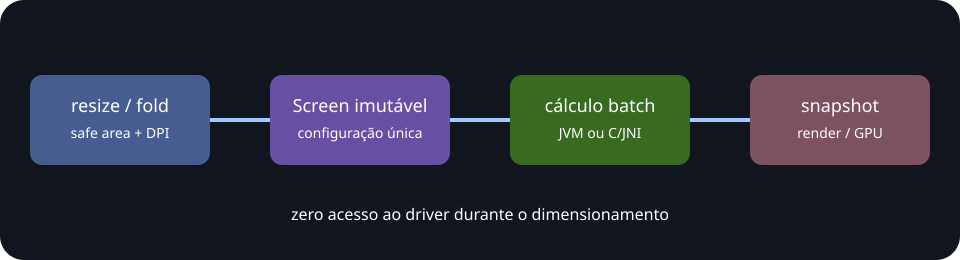

# Arquitetura greenfield

O core não importa Android, JNI, Compose, Vulkan ou OpenGL. O mesmo conjunto de contratos
é implementado em Java e C++. A camada Android faz apenas carregamento/versionamento e uma
travessia bulk. Prefab exporta exclusivamente o header C, evitando STL e name mangling.

## Regras do hot path

1. Estado de viewport é imutável.
2. Scalar não aloca e não mantém cache global.
3. Batch aceita operação in-place/sobreposta.
4. JNI recebe um `float[]` inteiro por chamada.
5. Nenhuma fórmula consulta filesystem, relógio, driver ou propriedades Android.
6. Erros são explícitos; não há fallback silencioso entre nativo e JVM.

## Threading

As funções são stateless e reentrantes. O chamador é responsável por publicar o novo array
de dimensões de maneira atômica para a render thread. Não mutacione um array enquanto a GPU
ou outra thread ainda o consome.

## ABI

Tipos C triviais e IDs explícitos formam o ABI. `ADG_ABI_VERSION` segue major/minor/patch;
mudanças incompatíveis incrementam major. Structs não contêm ponteiros internos ou ownership.
